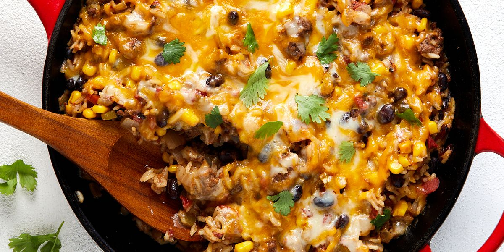

### recipe-app

This is a simple API build with `deno` and `aok` and is consumed using `qwik` client and `solidjs` client which are in the `apps` folder.

### server

The server is an authentication server that serves static recipes from a json file. authenticated users are stored in a `mysql` database server

### apps

Apps contains two web apps that are consuming this api which are:

1. solidjs - build using `solidjs`
2. `qwik` - build using `qwik`
